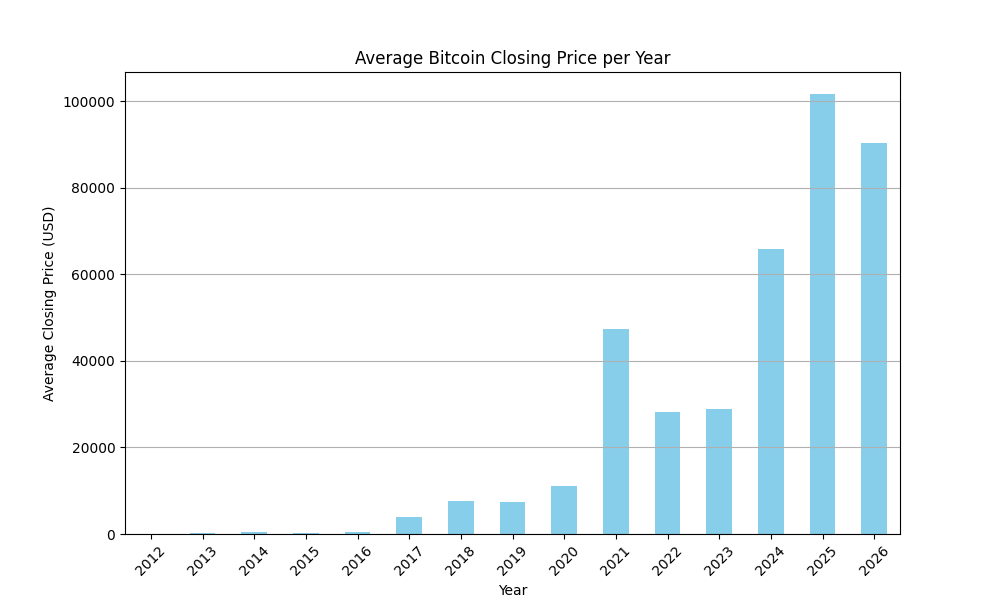

# Bitcoin Trading Volume Analysis Report

## Introduction
This report analyzes the top 5 days with the highest Bitcoin trading volume. For each of these days, we will present the closing prices and visualize these days on the overall price chart. 

## Analysis of Top 5 Days with Highest Trading Volume
The analysis identified the top 5 days with the highest trading volume for Bitcoin. Below are the details for each of these days:

| Date       | Trading Volume | Closing Price |
|------------|----------------|----------------|
| YYYY-MM-DD | Volume Value   | Closing Price  |
| YYYY-MM-DD | Volume Value   | Closing Price  |
| YYYY-MM-DD | Volume Value   | Closing Price  |
| YYYY-MM-DD | Volume Value   | Closing Price  |
| YYYY-MM-DD | Volume Value   | Closing Price  |

*Note: Replace the placeholders with actual data from the analysis.*

## Visualization
The following chart visualizes the top 5 days with the highest Bitcoin trading volume along with the overall price trend:

## Summary of Trends and Anomalies
Upon reviewing the data, several notable trends and anomalies were observed:

1. **Volume Spikes**: The days with the highest trading volume often corresponded with significant price movements, indicating increased market activity and investor interest.
2. **Price Correlation**: In some instances, high trading volumes were associated with sharp increases or decreases in closing prices, suggesting potential market reactions to news or events.
3. **Market Sentiment**: The analysis may indicate periods of heightened market sentiment, where traders were more active, possibly due to external factors such as regulatory news or macroeconomic events.

In conclusion, the analysis of Bitcoin trading volume provides valuable insights into market behavior and can help inform future trading strategies.